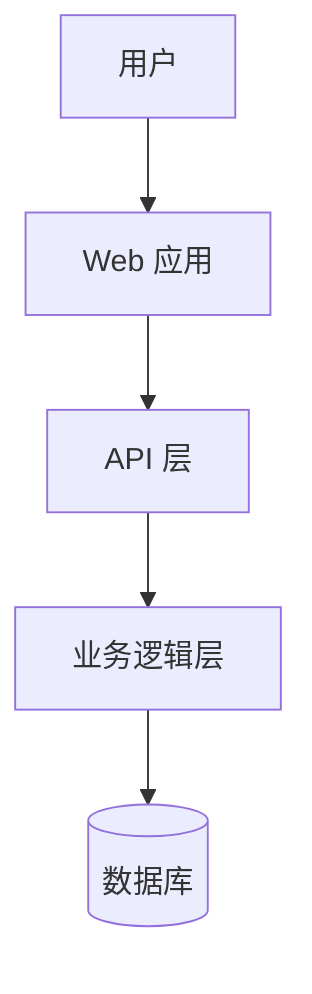

# AlanCodecoding — 全自动化多 Agent 协作开发流水线

> 版本: 1.0.0
> 适用: Kimi Code CLI
> 前置依赖: Codegraph MCP（可选但强烈推荐）

---

## 强制触发门槛（HARD GATE）

**以下任何场景发生时，你必须优先匹配本 Skill 的入口命令，不得直接写代码：**

- 用户说 "帮我开发一个/创建一个/写一个" 任何应用、功能、组件
- 用户说 "帮我改/加一个功能"（需要二次开发）
- 用户说 "一键/全自动开发"
- 用户输入 `AlanCodecoding:` 前缀的命令
- 用户说 "帮我建一个网站/API/工具"

---

## Karpathy Coding 原则（所有 Agent 必须遵守）

本流水线所有 Agent 在任何编码、审查、审计环节必须遵守以下四项原则：

### 原则 1: Think Before Coding（先思考再编码）

- **陈述假设**：在开始任何工作前，明确说出你的假设。不确定就问，不要猜
- **列出多种解释**：如果需求有歧义，列出可能的选项而不是默默选一个
- **对有更简单的方法时要说出来**
- **困惑时停下来**：明确指出哪里不清楚，不要硬着头皮做

> **在哪里执行**：Phase 1 需求分析、Phase 2 架构设计、Phase 3 每个 Agent 编码前

### 原则 2: Simplicity First（简单优先）

- **最少代码解决问题** — 不多写一行
- **不做需求以外的功能** — 没有"顺便"、没有"万一以后需要"
- **不为单次使用创建抽象层** — 三个类似片段好过一个过早抽象
- **不做未要求的"灵活扩展"** — YAGNI

> **在哪里执行**：Phase 3 编码、Phase 5 审计（检查过度设计）、Phase 6 优化（精简代码）

### 原则 3: Surgical Changes（外科手术式变更）

- **只动必须动的** — 不改相邻代码、不修无关注释、不改格式
- **不改没有坏的东西** — 不要重构正常工作的代码
- **匹配现有风格** — 即使你有不同偏好，新代码也要和周围的代码风格一致
- **只删除被你改得不再使用的东西**

> **在哪里执行**：Phase 3 编码、MODIFY 模式 M3-M4（二次开发时尤其重要）

### 原则 4: Goal-Driven Execution（目标驱动执行）

- **开始前定义成功标准** — 每个任务要有明确的完成条件
- **把"做 X"变成"验证 Y 通过，然后让它通过"** — 测试优先思维
- **多步骤任务格式**: `[步骤] → 验证: [检查项]`

> **在哪里执行**：整个流水线的每个质量门禁都是 Goal-Driven 的体现

---

| 命令 | 含义 | 适用用户 |
|---|---|---|
| `AlanCodecoding: quick <需求描述>` | 快车道 — 用项目模板，最少打断 | 小白、快速原型 |
| `AlanCodecoding: new <需求描述>` | 新项目标准流程，有用户确认点 | 普通用户 |
| `AlanCodecoding: pro <需求描述>` | 完整专业流程（含审计+优化+部署） | 专业开发者 |
| `AlanCodecoding: modify <需求描述>` | 修改已有项目（二次开发） | 所有用户 |
| `AlanCodecoding: resume` | 从 checkpoint 恢复中断的流水线 | 所有用户 |
| `AlanCodecoding: sync` | 同步本地的 Skill 修改到 GitHub | 开发者 |
| `AlanCodecoding: template` | 列出可用项目模板 | 小白 |

### 响应规则

用户输入入口命令后：
1. **必须** 读取 `lessons.json`（如存在）加载历史经验
2. **必须** 读取 `user-preferences.json`（如存在）加载用户偏好
3. 先理解用户需求，然后开始执行对应流水线

---

## 流水线全景图（NEW/PRO 模式）

```
Phase -1: Codegraph 安装检查 + 记忆加载
     │
Phase 0: 项目初始化 + 心跳基础设施
     │
Phase 1: 需求确认 [用户交互 — 纯中文]
     │
Phase 2: 架构设计 [用户交互 — 纯中文]
     │
     ├── [QUICK 模式: 跳过 Phase 2，使用模板内置架构]
     │
Phase 3: 多 Agent 并行编码 (❤️ 心跳核心阶段)
     │   ├─ HB-1: 单模块编码完成 → 编译+测试 → 通过→提交
     │   ├─ HB-2: 交叉审查通过 → 修复→重审→通过
     │   └─ HB-3: 集成合并 → 全量编译 → 失败→回滚
     │
Phase 4: 全量自动化测试
     │   └─ HB-4: 全部测试通过 → 失败→回滚到 HB-3
     │
     ├── [NEW 模式可在此结束 → Phase 8]
     │
Phase 5: 代码审计 + 安全审查 (双 Agent)
     │   └─ HB-5: 安全审计通过 → 失败→回滚到 HB-3
     │
Phase 6: 优化 + 文档生成
     │   └─ HB-6: 回归测试通过 → 失败→回滚优化前
     │
Phase 7: 部署配置 + CI/CD
     │   └─ HB-7: 部署验证通过
     │
Phase 8: 运行验证 + 交付 + 记忆更新
     │   └─ HB-FINAL: 最终运行验证 → 更新 lessons → 完成
```

## 流水线全景图（MODIFY 模式）

```
M0: Codebase Analysis (codegraph_explore)
M1: 需求 + 变更评估 [用户交互]
M2: 增量架构设计 [用户交互]
M3: 精确编码 (codegraph_node + callers)
M4: 测试更新 + 运行
M5: 审计 (codegraph_callers)
M6: 交付 + 记忆更新
```

---

## Phase -1: Codegraph 安装检查 + 记忆加载

### Step 1: 检查 Codegraph 可用性

```bash
# 尝试调用 MCP 工具确认 codegraph 可用
# 通过 mcp__codegraph__codegraph_explore 测试
```

尝试调用 `codegraph_explore`。如果可用 → 标记 `codegraph_available: true` 并进入 Step 3。

如果 MCP 调用失败 → 检查命令行工具：

```bash
where codegraph 2>/dev/null || echo "NOT_FOUND"
```

如果找到 → 标记 `codegraph_available: true`。
如果未找到 → 进入 Step 2。

### Step 2: 安装 Codegraph

**向用户询问（纯中文）：**
> "Codegraph 是一个代码索引工具，可以让 AI 精确理解代码结构，大大提升开发质量。
> 检测到您还没有安装，是否要现在安装？（推荐安装）"

用户选择安装 → 按顺序尝试：

```bash
# 方案 A: npm 安装
npm install -g @colbymchenry/codegraph

# 方案 B: git clone 安装（方案 A 失败时）
git clone https://github.com/colbymchenry/codegraph /tmp/codegraph
cd /tmp/codegraph && npm install -g

# 配置 MCP
kimi mcp add codegraph -- codegraph serve --mcp
```

用户拒绝安装 → 标记 `codegraph_available: false`，降级运行。

### Step 3: 加载记忆

```bash
# 读取全局用户偏好
.kimi-code/skills/alan-codecoding/user-preferences.json（如存在）
```

读取 lessons.json（如存在）→ 提取与当前项目类型相关的经验。
读取 project-memory.json（如存在，仅 MODIFY 模式）→ 了解项目历史。

**AI 向用户报告（如果 lessons 存在）：**
> "我已从之前 [N] 个项目中学习了经验，现在开始为您开发。"

### Step 4: 写入记忆

> 本阶段无记忆写入（记忆在 Phase 8 写入）。

### Checkpoint

写入 checkpoint: `{"phase": "phase-1", "codegraph_available": true/false, "lessons_loaded": N}`

---

## Phase 0: 项目初始化 + 心跳基础设施

### Step 1: 项目模式检测

```bash
# 检测是否已有项目
test -f .git && echo "EXISTING" || echo "NEW"
```

- 已有 `.git` → 标记 `project_mode: MODIFY`（除非用户明确说 new）
- 无 `.git` → 标记 `project_mode: NEW`

### Step 2: 创建项目目录

```bash
mkdir -p <project-name>
cd <project-name>
```

### Step 3: 初始化 Git（需用户授权）

**向用户询问（纯中文）：**
> "为了管理代码版本和实现自动回滚保护，我需要使用 Git。您希望怎样操作？
> (A) 完全授权 — 自动执行所有 Git 操作
> (B) 每次操作前问我
> (C) 不使用 Git（我将直接生成代码文件）"

根据用户选择设置 `git_auth_mode: full | per-request | none`。

如授权：
```bash
git init
git add -A && git commit -m "chore: initial commit [HB-0]"
```

### Step 4: 创建心跳基础设施

```bash
mkdir -p .alan-codecoding/
```

写入 `.alan-codecoding/project-memory.json`:
```json
{
  "project": {"name": "<project-name>", "mode": "<NEW|MODIFY>"},
  "heartbeats": [{"id": "HB-0", "phase": "init", "timestamp": "<now>", "status": "alive"}],
  "decisions": [],
  "patterns": []
}
```

写入 `.alan-codecoding/heartbeat-log.json`:
```json
[{"id": "HB-0", "phase": "init", "timestamp": "<now>", "status": "alive", "commit": "initial"}]
```

### Step 5: 初始化 Codegraph

如果 `codegraph_available: true`：
```bash
codegraph init
codegraph sync
```

### Checkpoint

写入 checkpoint: `{"phase": "phase0", "project_dir": "<path>", "git_auth": "<mode>", "heartbeat": "HB-0"}`

---

## Phase 1: 需求确认 + 假设陈述 [用户交互]

### Step 0: 陈述假设（Think Before Coding）

在展示任何方案前，**先明确说出你的假设**：

> "根据您的需求，我的理解是：
> - 您想要的是一个 [Web 应用 / API 服务 / CLI 工具 / ...]
> - 主要技术方向是 [Node.js / Python / Go / ...]
> - 需要 [数据库 / 用户认证 / 文件存储 / ...]
> - 用户规模大概是 [个人使用 / 小团队 / 公开上线]
> 
> 这些假设对吗？如果有不对的地方请告诉我，我重新规划"

如果用户纠正假设 → 更新理解 → 重新陈述。
如果用户确认假设 → 进入方案确认阶段。

### QUICK 模式

1. **模板匹配 + 假设陈述合并**：根据需求匹配最近模板 → 展示模板功能 + 技术假设
2. **向用户展示（纯中文）：**
   > "好的！我来帮您建一个 [模板名称]，功能包括：
   > - [功能1]
   > - [功能2]
   > - [功能3]
   > 技术方案：[简述]
   > 我的理解是您想要的是一个 [Web 应用 / API 服务 / CLI 工具]。
   > 
   > 这个方案和假设对吗？"
3. 用户确认 → 跳转到 Phase 3（跳过 Phase 2，使用模板内置架构）
4. 用户拒绝 → 根据反馈修改 → 最多 3 轮 → 超限升级
5. **如果无模板匹配** → 自动降级到 NEW 模式的 Phase 1 标准流程（走架构设计），不会卡住

### NEW / PRO 模式

1. 派 2-3 个 Agent 独立分析用户需求
2. Agent 间讨论、合并分析结果
3. 输出 PRD 文档 `docs/requirements.md`
4. **向用户展示功能清单（纯中文，无术语）：**
   > "我理解您想要的是一个 [项目类型]，核心功能有：
   > 1. [功能1描述]
   > 2. [功能2描述]
   > 3. [功能3描述]
   > 
   > 这些功能符合您的预期吗？
   > - 如果满意，说"确认"我就继续
   > - 如果需要调整，告诉我具体想改什么"
5. 用户确认 → 进入 Phase 2
6. 用户拒绝 → 修改 → 重提（最多 3 轮）→ 3 轮后升级：继续/接受/终止

### MODIFY 模式 → 参考 MODIFY 模式章节的 M1

### Checkpoint

```json
{"phase": "phase1", "confirmed": true, "requirements": "docs/requirements.md"}
```

---

## Phase 2: 架构设计

> QUICK 模式：**跳过本阶段**，使用模板内置架构方案。

### Step 1: 技术选型 + 环境检查

派 Architect Agent（读取 `references/prompts/00-architect.md`）：
- 确定技术栈（参考 `lessons.json` 和 `user-preferences.json`）
- 确定 CI/CD 平台
- 确定数据库/ORM/迁移策略
- 确定安全风险分类（Web / API / CLI / Library）

环境检查（**根据技术选型结果动态确定检查项**，不局限于以下三种）：
```bash
# 检查运行时是否安装（按技术选型结果选择对应的检查命令）
# 常用运行时的检查命令:
# Node.js:  node --version 2>/dev/null || echo "NODE_NOT_FOUND"
# Python:   python --version 2>/dev/null || echo "PYTHON_NOT_FOUND"
# Go:       go version 2>/dev/null || echo "GO_NOT_FOUND"
# Java:     java -version 2>/dev/null || echo "JAVA_NOT_FOUND"
# Rust:     rustc --version 2>/dev/null || echo "RUST_NOT_FOUND"
# PHP:      php --version 2>/dev/null || echo "PHP_NOT_FOUND"
```

如果运行时未安装 → **向用户提示**（纯中文）：
> "检测到您的电脑还没有安装 [运行时]，请先安装：
> 下载地址：[官方链接]
> 安装完成后告诉我，我继续为您开发"

### Step 2: 多 Agent 架构方案讨论（平等协作）

1. 派 2-3 个 Architect Agent，各自独立提出架构方案
2. 汇总方案 → Agent 间讨论差异 → 投票确定最终方案
3. 记录决策到 `project-memory.json`

### Step 3: 产出架构文档

- `docs/adr.md` — 架构决策记录
- `docs/api-spec.md` — API 接口规范
- `docs/schema.sql` — 数据库 Schema（如适用）
- `docs/tasks.json` — 任务分解清单（含依赖关系）
- `shared/types.ts`（或相应语言）— 共享类型/接口定义
- `docs/shared-contract.md` — 共享契约（错误处理、日志、命名规范等）
- `.gitignore` — 按技术栈生成
- `.editorconfig` — 缩进风格设置

### Step 4: Pre-flight 验证

派独立验证 Agent：
1. 检查所有模块接口是否完整定义
2. 检查任务依赖关系是否正确
3. 检查共享契约是否覆盖所有必要约定
4. 发现缺口 → 修复 → 重新验证

### Step 5: 安装依赖

```bash
# 根据技术栈
npm init -y && npm install <dependencies>
# 或
pip install -r requirements.txt
# 或
go mod init <project> && go mod tidy
```

失败处理：重试 3 次 → 检查网络 → 升级用户

### Step 6: 用户确认（纯中文）

**向用户展示（无术语）：**
> "您的 [项目名称] 我计划这样搭建：
> - 使用 [技术] 开发
> - 包含 [N] 个功能模块
> - 使用 [数据库类型] 存储数据
> 
> 这个方案您满意吗？
> - 满意 → 说"确认"
> - 想调整 → 告诉我具体哪里想改"

用户确认 → 进入 Phase 3
用户拒绝 → 修改（最多 3 轮）→ 超限升级

### Step 7: Codegraph 索引初始化

如果 `codegraph_available: true`：
```bash
codegraph init
codegraph sync
```

### Checkpoint

```json
{"phase": "phase2", "tech_stack": "<details>", "tasks_count": N}
```

---

## Phase 3: 多 Agent 并行编码 (❤️ 心跳核心阶段)

这是**流水线的核心阶段**，也是**心跳机制的核心**。每个变更必须保持代码健康。

### Step 1: 依赖安装确认

```bash
# 验证依赖已安装（根据技术栈选择命令）
# Node:     npm ls 2>/dev/null || npm install
# Python:   pip list 2>/dev/null || pip install -r requirements.txt
# Go:       go list -m 2>/dev/null || go mod tidy
```

### Step 2: Git 分支创建（如授权）

```bash
git checkout -b develop
# 为每个 Task 创建独立分支
for task in task-list; do
  git checkout -b feat/module-$task
done
git checkout develop
```

### Step 3: 并行实现（使用独立 Agent 调用，非 AgentSwarm）

对 `docs/tasks.json` 中的每个 Task，派一个独立的 Implementer Agent。

> **Agent 数量管理**：
> - 同时最多派 **5-8 个** Agent（防止上下文耗尽）
> - 如果 Task 超过 8 个 → 按依赖关系分组，组内并行、组间串行
> - 如果 Task 少于 2 个 → 仍然派 1 个 Agent 实现，交叉审查时使用独立 Reviewer Agent

**Agent 获取的上下文：**
```json
{
  "task": {...},        // 从 tasks.json 读取
  "interfaces": {...},  // 接口定义
  "shared_types": "...", // 共享类型
  "arch_doc": "docs/adr.md",
  "codegraph_available": true/false
}
```

每个 Implementer Agent 执行（读取 `references/prompts/01-implementer.md`）：
1. 读取共享契约和接口定义
2. 如果 codegraph 可用：`codegraph_node` 读取需要修改的文件
3. 如果 codegraph 可用：`codegraph_callers` 检查修改影响
4. 实现代码
5. 编写/更新测试
6. 自测（编译 + 测试）
7. ❤️ **心跳 HB-1**: 自测通过 → 提交代码
   ```bash
   git add -A && git commit -m "feat: <module> [HB-1]"
   ```
   自测失败 → Agent 修复 → 循环直到通过（不提交破损代码）

**依赖请求规则**：如果 Agent 需要新的依赖 → 向父 Agent 提出 → 父 Agent 评估 → 统一安装 → 通知所有 Agent

**架构偏差规则**：如果 Agent 发现架构设计无法支撑需求 → 返回 `ARCHITECTURE_DEVIATION` 状态 → 暂停 → 升级用户

### Step 4: 交叉审查

策略选择：
- **≥3 个 Agent**: 轮询模式 A→B→C→A（非双向）
- **<3 个 Agent**: 派独立 Reviewer Agent

派 Reviewer Agent（读取 `references/prompts/02-reviewer.md`）：
- 审查代码
- 如果 codegraph 可用：`codegraph_callers` 验证调用链完整性
- 输出审查报告

审查结论处理：
- `APPROVED` → ❤️ **心跳 HB-2**: 通过
- `CHANGES_REQUESTED` → Implementer 修复 → 重新审查
- `REJECTED` → Implementer 重写 → 重新审查

### Step 5: 集成仲裁

1. 将所有 `feat/module-*` 分支按依赖顺序 merge 到 `develop`
2. 解决合并冲突
3. 验证接口契约一致性
4. 全量编译验证
5. ❤️ **心跳 HB-3**: 编译通过 → 提交
   ```bash
   git merge feat/module-* --no-ff
   git commit -m "merge: integrate all modules [HB-3]"
   ```
   编译失败 → `git revert` 到 HB-2 → 修复依赖 → 重新合并

### Step 6: 写入记忆

```json
{
  "patterns": "编码中发现的代码模式",
  "issues": "遇到的问题和解决方案",
  "modules": "模块完成清单"
}
```

### Codegraph 同步

```bash
codegraph sync  // 仅 codegraph_available 时
```

### Checkpoint

```json
{"phase": "phase3", "heartbeat": "HB-3", "completed_tasks": N}
```

---

## Phase 4: 全量自动化测试

### Step 1: 测试环境准备

```bash
# 根据项目类型设置测试环境
# Web 应用: 启动测试数据库、mock 服务
# CLI 工具: 无需特殊环境
# API 服务: 启动测试服务器
```

等待服务就绪（最多 30 秒）→ 超时则报告 Setup 失败。

### Step 2: 派 Tester Agent

派 Tester Agent（读取 `references/prompts/04-tester.md`）：
- 编写单元测试覆盖所有模块
- 编写集成测试覆盖模块间交互
- 编写 E2E 测试覆盖关键用户路径

如果 codegraph 可用：
- `codegraph_callers(modified_symbols)` — 找到所有受影响的现有测试

### Step 3: 运行测试

```bash
# 根据技术栈运行测试
# Node:     npm test 2>&1
# Python:   pytest 2>&1
# Go:       go test ./... 2>&1
```

### Step 4: 测试环境清理

```bash
# 关闭测试服务、清理测试数据
```

### Step 5: 门禁判定

- **全部通过 + 覆盖率 ≥ 80%** → ❤️ **心跳 HB-4**: 通过
  ```bash
  git add -A && git commit -m "test: full test suite [HB-4]"
  ```
- **失败** → 标记失败模块 → 精准回退（只重跑失败模块对应的 Agent）

**精准回退**：
1. 分析测试失败详情 → 定位到具体模块
2. 只重新派发该模块的 Implementer Agent
3. 修复后重新运行受影响的测试
4. 最多 3 轮 → 超限升级用户

### Checkpoint

```json
{"phase": "phase4", "heartbeat": "HB-4", "coverage": "N%", "tests_passed": "N"}
```

> **NEW 模式注意**：如果当前是 NEW 模式且用户走的是标准路径，在此处可以跳转到 Phase 8（交付），跳过 Phase 5-7（审计/优化/部署）。

---

## Phase 5: 代码审计 + 安全审查（双 Agent 协作）

### Step 1: 双 Agent 独立审计

派 2 个 Auditor Agent（读取 `references/prompts/03-auditor.md`）：
- 各自独立审计全部代码
- 各自输出审计报告

### Step 2: 审计内容

每个 Auditor Agent 执行：
1. **静态分析**
   ```bash
   # 运行 lint（根据技术栈选择命令，如工具未配置则跳过）
   # Node:     npm run lint 2>/dev/null || npx eslint . 2>/dev/null || true
   # Python:   flake8 . 2>/dev/null || pylint src/ 2>/dev/null || true
   # Go:       go vet ./... 2>/dev/null || true
   ```
2. **安全审计**（根据项目安全风险分类选择检查清单）
3. **依赖漏洞审查**
   ```bash
   # 根据技术栈选择漏洞审查工具（如不可用则跳过）
   # Node:     npm audit --audit-level=high 2>/dev/null || echo "NPM_AUDIT_UNAVAILABLE"
   #           （内网环境可尝试: npm audit --registry=https://registry.npmjs.org）
   # Python:   pip-audit 2>/dev/null || safety check 2>/dev/null || echo "AUDIT_UNAVAILABLE"
   # Go:       govulncheck ./... 2>/dev/null || echo "AUDIT_UNAVAILABLE"
   ```
4. **架构合规性校验**
   - 如果 codegraph 可用：`codegraph_callers` 验证所有调用链完整
   - 如果 codegraph 可用：`codegraph_explore("模块间的接口是否按照架构设计实现？")`
5. **心跳验证** — 确认 HB-4 通过的代码无回归

### Step 3: 交叉核对

合并两个 Auditor 的发现：
- 共同发现 → 确认问题
- 差异 → 讨论 → 裁决

### Step 4: 门禁判定

- **零高危漏洞 + lint 零错误 + 架构合规** → ❤️ **心跳 HB-5**: 通过
  ```bash
  git add -A && git commit -m "audit: security audit passed [HB-5]"
  ```
- **失败** → 标记问题模块 → 精准回退到 Phase 3（最多 3 次）→ 超限升级

### Checkpoint

```json
{"phase": "phase5", "heartbeat": "HB-5", "audit_result": "pass/fail"}
```

---

## Phase 6: 优化 + 文档生成

### Step 1: 双 Agent 优化协作

派两个 Agent：
- **Opt Agent**: 性能热点分析 → 针对性优化
- **Verify Agent**: 验证优化不破坏功能

```bash
# Opt Agent 分析
# - 检查代码中可优化的模式
# - 优化性能瓶颈
# - 精简代码（去重、死代码、未使用依赖）

# Verify Agent
# - 如果 codegraph 可用: codegraph_callers 验证修改是否完整
# - 确认功能行为不变
```

### Step 2: 回归测试门禁

```bash
# 根据技术栈运行全量测试（同 Phase 4）
# Node: npm test 2>&1 | Python: pytest 2>&1 | Go: go test ./... 2>&1
```

### Step 3: 快速安全复查

> ⚠️ **优化可能引入新安全问题**（比如精简代码时移除了安全检查）。
> 
> 在复查前先同步 codegraph 索引：
> ```bash
> codegraph sync  // 仅 codegraph_available 时
> ```
> 
> 然后根据安全检查清单逐一核查：
> 1. 本次优化是否修改了**认证/授权**相关代码？ → 验证权限逻辑未被绕过
> 2. 本次优化是否修改了**输入验证**代码？ → 验证注入防护未被移除
> 3. 本次优化是否修改了**加密/敏感数据处理**？ → 验证加密逻辑未被削弱
> 4. 本次优化是否**删除了看似无用但有安全作用的代码**？
> 5. 使用 `codegraph_explore("优化后的代码是否有新的安全问题？")`（如可用）
> 6. 如果无 Codegraph：手动审查优化修改的安全相关代码
> - 发现问题 → 回退优化 → 重新优化

- **全部通过** → ❤️ **心跳 HB-6**: 通过
  ```bash
  git add -A && git commit -m "perf: optimization [HB-6]"
  ```
- **失败** → 回退到优化前的代码（git revert）→ 最多 3 次

### Step 3: 文档生成

派 DevOps Agent（读取 `references/prompts/05-devops.md`）：

**README.md** — 包含：
- 项目名称和描述
- 快速启动命令（复制即可运行）
- 项目结构
- 技术栈

**API 文档**（如果适用）：
- 所有端点列表
- 请求/响应示例

**Mermaid 架构图**（示例 — 实际运行时根据项目生成）：


### Checkpoint

```json
{"phase": "phase6", "heartbeat": "HB-6"}
```

---

## Phase 7: 部署配置 + 验证

### Step 1: DevOps Agent 生成配置

派 DevOps Agent（读取 `references/prompts/05-devops.md`）：
- 生成 Dockerfile（多阶段构建、安全最佳实践）
- 生成 Docker Compose（如适用）
- 生成 CI/CD 配置（根据 Phase 2 决策的平台）
- 生成 `.env.example`
- 生成 `start.bat`（Windows）和 `start.sh`（Unix）

### Step 2: 编码 Agent Review 配置

派一个 Implementer Agent 审查 DevOps 配置：
- Dockerfile 语法和最佳实践
- CI/CD 配置正确性
- 环境变量完整性

### Step 3: 语法验证

```bash
# Dockerfile 语法检查（如 docker 可用）
docker compose config 2>/dev/null || echo "DOCKER_NOT_AVAILABLE"
```

### Step 4: 门禁判定

- **语法校验通过** → ❤️ **心跳 HB-7**: 通过
  ```bash
  git add -A && git commit -m "deploy: deployment config [HB-7]"
  ```
- **失败** → 修改 → 重新验证（最多 3 次）

### Checkpoint

```json
{"phase": "phase7", "heartbeat": "HB-7", "deploy_config": "ready"}
```

---

## Phase 8: 运行验证 + 交付 + 记忆更新

### Step 1: 运行验证

根据项目类型选择验证方式：

**Web 应用：**
```bash
# 启动应用（根据技术栈选择命令）
# Node:   npm start &
# Python: python main.py &
```
# 等待就绪（最多 30 秒）
for i in $(seq 1 30); do
  curl -s http://localhost:3000/health >/dev/null 2>&1 && break
  sleep 1
done
# 检测端口（如果 3000 被占用，尝试 3001, 3002...）
```
- 启动成功 → 继续
- 启动失败 → 诊断原因 → 修复 → 重新验证

**CLI 工具：**
```bash
# 根据技术栈验证 CLI
# Node:   node index.js --help
# Python: python main.py --help
# Go:     go run main.go --help 或 ./<binary> --help
```
- 输出正常 → 继续

**API 服务：**
```bash
curl -s http://localhost:<port>/ | head -20
```
- 返回预期结果 → 继续

### Step 2: Git 操作

根据 Git 授权模式：
- **完全授权**: 合并到 main → tag → 清理分支
  ```bash
  git checkout main
  git merge develop --no-ff -m "release: v1.0.0 [HB-FINAL]"
  git tag v1.0.0
  git branch -D feat/module-*
  ```
- **每次确认**: 每次操作前 AskUserQuestion
- **不使用 Git**: 跳过，直接输出文件

### Step 3: CHANGELOG 生成

基于 Git 提交历史生成：
```markdown
# Changelog

## v1.0.0
### Features
- [功能1]
- [功能2]
### Bug Fixes
- ...
```

### Step 4: ❤️ 最终心跳 HB-FINAL

```bash
git commit --allow-empty -m "chore: final heartbeat [HB-FINAL]"
```

更新 `.alan-codecoding/heartbeat-log.json`。

### Step 5: 记忆更新

更新 `lessons.json`（跨项目经验）：
```json
{
  "lessons": [
    {
      "project": "<project-name>",
      "phase": "<phase>",
      "tech_stack": "<stack>",
      "what_worked": ["有效的方法"],
      "what_didnt": ["无效的方法"],
      "bugs_found": ["遇到的 bug"],
      "improvements": ["下次可以改进的"]
    }
  ],
  "patterns": ["总结的代码模式"],
  "anti_patterns": ["避免的反模式"]
}
```

更新 `user-preferences.json`（如果发现新偏好）。

### Step 6: 纯中文交付报告

**向用户报告（纯中文，零术语）：**

> "✅ [项目名称] 开发完成！
> 
> 📁 项目位置: [完整路径]
> 
> 🚀 在本地运行：
> 1. 打开终端（按 Win+R，输入 cmd，回车）
> 2. 复制粘贴以下命令：
>    ```
>    cd [项目目录]
>    [启动命令]
>    ```
> 3. 打开浏览器访问: [URL]
> 
> 📦 项目包含：
> - [功能清单]
> 
> ✅ 质量保障：
> - [N] 个测试全部通过
> - 代码覆盖率 [N]%
> - 安全审计通过
> 
> 💡 想加功能？
> 直接说："AlanCodecoding: modify 帮我加一个[功能]"
> 
> ❓ 遇到问题？
> - 运行 start.bat（Windows）或 start.sh（Mac/Linux）一键启动
> - 或者在项目目录运行 [命令]"

### Checkpoint

```json
{"phase": "all-complete", "heartbeat": "HB-FINAL", "completed_at": "<timestamp>"}
```

---

## MODIFY 模式：二次开发流水线

当用户说 `AlanCodecoding: modify <需求>` 时，执行以下子流水线：

### M0: Codegraph 初始化 + 记忆加载

```bash
# 检查 codegraph 可用性（同 Phase -1）
# 检查是否已有 .codegraph/ 目录
# 如无 → codegraph init
# 如有 → codegraph sync

# 读取 project-memory.json（如存在）
# 读取 lessons.json（如存在）
```

### M1: Codebase Analysis（代码理解）

派 Explorer Agent：

**如果 codegraph 可用：**
```bash
codegraph_explore("这个项目的整体架构是什么样的？主要有哪些模块？")
codegraph_explore("项目用了哪些技术栈？目录结构如何组织？")
codegraph_explore("和数据相关的模块在哪？路由在哪？")
```

**如果 codegraph 不可用（降级方案）：**
```bash
# 用 Glob + Grep + Read 手动分析
# 1. 查看项目文件结构: ls/ls -R（Windows: dir /s）
# 2. 识别技术栈: 检查 package.json / pyproject.toml / go.mod
# 3. 阅读主要入口文件
# 4. 阅读关键模块代码
```

**两种情况都执行以下流程：**
1. Agent 汇总分析结果 → 生成"代码理解报告"
2. 识别项目技术栈和模块结构
3. 理解数据流和路由组织

**向用户报告（纯中文）：**
> "我已经了解了您的项目结构，现在开始添加 [功能]。需要修改 [N] 个文件、新增 [M] 个文件。这个方案您满意吗？"

### M2: 需求确认 + 变更评估

1. 理解用户的新需求
2. 如果 codegraph 可用：`codegraph_explore("实现这个功能需要修改哪些模块？")`
3. 输出变更影响分析（文件数、模块数）

**用户确认流程同 Phase 1。**

### M3: 增量架构设计

1. 如果 codegraph 可用：`codegraph_node` 读取关键模块的当前实现
2. 如果 codegraph 可用：`codegraph_callers` 评估影响范围
3. 设计最小改动方案（尊重现有模式，不做不必要的重构）

**用户确认流程同 Phase 2。**

### M4: 精确编码（Codegraph 全程辅助）

1. 依赖安装（如有新增依赖）
2. 对每个要修改的符号：
   - `codegraph_node(symbol)` 读取完整上下文
   - `codegraph_callers(symbol)` 检查所有调用者
   - 修改实现
3. 自测 + 交叉审查 + 集成
4. ❤️ **心跳 HB-M1 ~ HB-M3**（同 Phase 3 心跳机制）
5. `codegraph sync`

### M5: 测试更新 + 运行

1. `codegraph_callers(修改过的函数)` 找到所有受影响的测试
2. 更新现有测试 + 新增功能测试
3. 运行全量测试（确保没破坏任何现有功能）
4. ❤️ **心跳 HB-M4**

### M6: 审计

1. 双 Agent 独立审计（同 Phase 5）
2. `codegraph_callers` 验证所有调用链完整
3. ❤️ **心跳 HB-M5**

### M7: 交付 + 记忆更新

1. 运行验证（同 Phase 8）
2. Git 操作（按授权模式）
3. 更新 lessons.json + project-memory.json
4. 纯中文交付报告

---

## ❤️ 心跳系统（Heartbeat System）

### 概念

**心跳 = 一条确保代码健康的快照点。** 每次心跳都是一个经过验证的健康 Git 提交。

- 代码有编译错误 → 心脏骤停
- 代码有测试失败 → 生命体征异常
- 代码有安全漏洞 → 慢性中毒
- 心跳自动回滚 → 起死回生

### 心跳检测矩阵

| 心跳 ID | 阶段 | 检测项 | 死亡判定 | 复活手段 |
|---|---|---|---|---|
| HB-0 | Phase 0 | 空仓库就绪 | — | — |
| HB-1 | Phase 3 | 单模块编译+测试 | 编译失败/测试失败 | Agent 修复后重提 |
| HB-2 | Phase 3 | 交叉审查 | 发现 BLOCKER | 修复后重审 |
| HB-3 | Phase 3 | 集成编译+接口验证 | 合并冲突/接口不匹配 | git revert 到 HB-2 |
| HB-4 | Phase 4 | 全量测试+覆盖率≥80% | 测试失败/覆盖不足 | 精准回退到 Phase 3 |
| HB-5 | Phase 5 | 安全审计+lint | 高危漏洞/lint错误 | 精准回退到 Phase 3 |
| HB-6 | Phase 6 | 回归测试 | 优化破坏功能 | git revert 到 HB-5 代码 |
| HB-7 | Phase 7 | 部署配置语法校验 | 语法错误 | 修改后重验 |
| HB-FINAL | Phase 8 | 运行验证 | 无法启动/功能异常 | 修复后重验 |

### 回滚机制

```bash
# 当 HB-N 死亡时：
git log --oneline | grep "\[HB-<N-1>\]"  # 找到上一个心跳
git revert HEAD --no-commit              # 回滚到上一个健康状态
git commit -m "revert: rollback to HB-<N-1>"
```

### 心跳日志

写入 `.alan-codecoding/heartbeat-log.json`：
```json
[
  {"id": "HB-0", "phase": "init", "timestamp": "...", "status": "alive"},
  {"id": "HB-1", "phase": "coding", "timestamp": "...", "status": "alive"},
  {"id": "HB-3", "phase": "integrate", "timestamp": "...", "status": "alive"},
  ...
]
```

每个心跳提交的 commit message 包含 `[HB-N]` 标签，方便追溯。

---

## 🧠 记忆系统（Memory System）

### 三级记忆架构

#### 第一级: 项目记忆 (project-memory.json)

**存储位置**: `.alan-codecoding/project-memory.json`
**作用域**: 当前项目（跨会话）
**内容**:
- 项目元信息（名称、技术栈、模式）
- 架构决策记录（为什么选这个方案）
- 代码模式（项目的独特约定）
- 用户偏好（缩进、命名风格等）

**读写时机**:
- 写入: Phase 2（决策）、Phase 3（编码模式）、Phase 8（最终更新）
- 读取: Phase -1（启动时加载），MODIFY M0

#### 第二级: 经验记忆 (lessons.json)

**存储位置**: `.alan-codecoding/lessons.json`
**作用域**: 所有项目（跨项目）
**内容**:
- 什么技术选型有效
- 遇到过什么问题 + 怎么解决的
- 总结的代码模式
- 避免的反模式

**读写时机**:
- 写入: Phase 8（每次项目完成）
- 读取: Phase -1（每次流水线启动时加载）

**示例**:
```json
{
  "lessons": [
    {
      "project": "book-manager",
      "tech_stack": ["node", "express", "sqlite"],
      "what_worked": [
        "使用 express.Router() 按模块拆分路由",
        "SQLite 适合单用户应用"
      ],
      "what_didnt": [
        "在路由层写业务逻辑导致难以测试"
      ],
      "solutions": [
        "抽取 service 层处理业务逻辑"
      ]
    }
  ]
}
```

#### 第三级: 用户偏好 (user-preferences.json)

**存储位置**: `.kimi-code/skills/alan-codecoding/user-preferences.json`
**作用域**: 全局（跨项目、跨会话）
**内容**: 用户的技术偏好（TypeScript vs JS、pnpm vs npm、React vs Vue 等）

**读写时机**:
- 写入: Phase 8（如果发现新偏好）
- 读取: Phase -1（每次启动时加载）

### 自适应记忆

每次启动流水线时，AI 自动读取 lessons.json 和 user-preferences.json → 将相关经验融入当前决策。这叫"自适应记忆"——不是 SKILL 自我进化（那不可行），而是每次都从过去的经验中受益。

---

## 质量门禁汇总

| 门禁 ID | 阶段 | 检查项 | 失败处理 | 最大重试 |
|---|---|---|---|---|
| GATE-COMPILE | Phase 3 | 编译/类型检查零错误 | 精准回退失败模块 | 3 |
| GATE-TEST | Phase 4 | 覆盖率≥80%+全部测试通过 | 精准回退 | 3 |
| GATE-SECURITY | Phase 5 | 高危=0 + lint=0 + 架构合规 | 精准回退 | 3 |
| GATE-REGRESSION | Phase 6 | 优化后测试全量通过 | 回退优化前代码 | 3 |
| GATE-DEPLOY | Phase 7 | CI/CD 配置语法正确 | 修改后重验 | 3 |

---

## 错误处理层级

| 层级 | 场景 | 处理方式 |
|---|---|---|
| 1 | 工具调用异常（命令失败、超时） | 自动重试 3 次 → 成功则继续 → 失败则升级 |
| 2 | Agent BLOCKED | 分析原因 → 补充上下文 → 重新派发（最多 3 次） |
| 3 | 质量门禁失败 | 精准回退（只重跑失败模块）→ 最多 3 轮 → 升级用户 |
| 4 | 架构偏差（编码中发现架构无法支撑需求） | ❗暂停自动模式 → 向用户报告 → 请求决策：修架构/降需求 |
| 5 | 资源耗尽（上下文限制、超时等） | 保存 checkpoint → 提示用户 "AlanCodecoding: resume" 恢复 |
| 6 | 以上全部失败 | 向用户报告完整失败详情 → 请求人工介入 |

---

## 自适应路径矩阵

| 项目特征 | 推荐模式 | 走哪些 Phase | 预计交互轮数 |
|---|---|---|---|
| 静态页面 (1-3 文件) | quick | -1→0→1→3→4→8 | 3-5 |
| CRUD Web (有数据库) | new | -1→0→1→2→3→4→8 | 8-15 |
| 全栈应用 (认证+多模块) | new/pro | 全部 | 15-30 |
| 微服务 | pro | 全部 + 额外 | 20-40 |
| 修改已有项目 | modify | M0→M1→M2→M3→M4→M5→M6→M7 | 5-12 |
| 给现有项目加小功能 | modify | M0→M1→M2→M3→M4→M6→M7 | 5-8 |

---

## 项目模板库

### 模板匹配逻辑

用户说"帮我建一个..." → AI 匹配最接近的模板 → 展示功能清单 → 用户确认。

### 模板清单

```json
[
  {
    "id": "static-site",
    "name": "静态个人主页",
    "tech": ["html", "css"],
    "complexity": "simple",
    "features": ["个人信息展示", "作品集", "联系方式"],
    "files": ["index.html", "style.css"]
  },
  {
    "id": "landing-page",
    "name": "产品 Landing Page",
    "tech": ["html", "css", "js"],
    "complexity": "simple",
    "features": ["产品介绍", "特性展示", "CTA 按钮"],
    "files": ["index.html", "style.css", "script.js"]
  },
  {
    "id": "crud-web-app",
    "name": "CRUD 数据管理系统",
    "tech": ["node", "express", "sqlite", "html"],
    "complexity": "medium",
    "features": ["数据列表展示", "新增/编辑/删除", "搜索过滤"],
    "files": ["package.json", "src/index.js", "src/db.js", "views/"]
  },
  {
    "id": "rest-api",
    "name": "RESTful API 服务",
    "tech": ["node", "express"],
    "complexity": "medium",
    "features": ["REST 接口", "数据验证", "错误处理"],
    "files": ["package.json", "src/index.js", "src/routes/", "src/middleware/"]
  },
  {
    "id": "cli-tool",
    "name": "命令行工具",
    "tech": ["node", "commander"],
    "complexity": "simple",
    "features": ["命令解析", "参数处理", "帮助信息"],
    "files": ["package.json", "src/index.js"]
  },
  {
    "id": "blog-fullstack",
    "name": "博客系统（全栈）",
    "tech": ["node", "express", "sqlite", "react"],
    "complexity": "medium",
    "features": ["文章 CRUD", "Markdown 编辑", "标签分类", "评论"],
    "files": ["package.json", "server/", "client/"]
  },
  {
    "id": "auth-system",
    "name": "用户认证系统",
    "tech": ["node", "express", "passport", "sqlite"],
    "complexity": "medium",
    "features": ["注册/登录", "密码加密", "Session 管理", "权限控制"],
    "files": ["package.json", "src/auth/", "src/middleware/", "src/models/"]
  },
  {
    "id": "dashboard",
    "name": "管理后台",
    "tech": ["react", "chart.js"],
    "complexity": "medium",
    "features": ["数据仪表盘", "图表展示", "数据表格", "筛选器"],
    "files": ["package.json", "src/App.jsx", "src/components/"]
  }
]
```

当 quick 模式匹配到模板时，AI 读取模板的 features 和 files 描述，动态生成项目骨架。

---

## 工具映射

| 功能 | Kimi Code CLI 实现 |
|---|---|
| 派发子 Agent | `Agent(subagent_type="coder")` 或 `Agent(subagent_type="explore")` |
| 并行派发 | `AgentSwarm`（仅适用于同模板任务） |
| 阅读文件 | `Read` 或 `mcp__codegraph__codegraph_node` |
| 编辑文件 | `Edit` |
| 写文件 | `Write` |
| 搜索文件 | `Glob` |
| 搜索代码 | `Grep` 或 `mcp__codegraph__codegraph_search` |
| 运行命令 | `Bash` |
| 代码理解 | `mcp__codegraph__codegraph_explore` |
| 影响分析 | `mcp__codegraph__codegraph_callers` |
| 读取符号 | `mcp__codegraph__codegraph_node(symbol)` |
| 用户确认 | `AskUserQuestion`（纯中文、零术语） |
| 写入记忆 | `Write` 到 `.alan-codecoding/` 目录 |
| 计划模式 | `EnterPlanMode` / `ExitPlanMode` |
| 加载子技能 | `Skill`（读取对应 prompt 模板） |
| 加载 lessons | `Read(.alan-codecoding/lessons.json)` |
| 恢复流水线 | 检测 checkpoint → 跳过已完成阶段 |

---

## Sync 命令：自动同步 Skill 修改到 GitHub

当你修改了本 Skill 的文件后（比如优化了 SKILL.md、改了 prompt 模板），用 `AlanCodecoding: sync` 自动推送到 GitHub。

### 前置要求

需要在项目目录创建 `.github-token` 文件：

```bash
cd ~/.kimi-code/skills/alan-codecoding
echo '你的GitHubToken' > .github-token
```

或者设置环境变量：
```bash
export GITHUB_TOKEN=你的GitHubToken
```

### 执行流程

```
用户: "AlanCodecoding: sync"
    │
    ├─ Step 1: 扫描本地 Skill 目录所有文件
    ├─ Step 2: 查询 GitHub 上的远程文件列表
    ├─ Step 3: 对比差异（新建 / 更新 / 删除）
    ├─ Step 4: 展示变更预览给用户确认
    ├─ Step 5: 用户确认 → 通过 API 逐一推送
    └─ Step 6: 报告同步结果
```

### 底层实现

调用 `sync_to_github.py` 脚本完成实际同步：
- 使用 GitHub Contents API（不依赖 git 命令）
- 逐个文件对比内容 hash，只推送有变更的文件
- 支持新建、修改、删除三种操作
- 支持 `--dry-run` 预览模式

### 手动运行（不需 AI 辅助）

```bash
cd ~/.kimi-code/skills/alan-codecoding

# 预览变更
python sync_to_github.py --dry-run

# 执行同步
python sync_to_github.py

# 指定 Token
python sync_to_github.py --token ghp_xxx
```

---

## 连续性规则

1. **不得在中途退出去执行其他无关任务**
2. **不得跳过任何阶段**（除非自适应路径明确跳过）
3. **用户确认必须用纯中文、零术语**
4. **心跳提交必须是健康的** — 不提交破损代码
5. **精准回退** — 失败时只重跑失败模块，不是全部
6. **错误升级** — 超过最大重试次数后必须升级用户
7. **记忆持续积累** — 每次完成都必须更新 lessons.json
8. **面向小白** — 所有与用户的沟通用纯中文业务语言，不用技术术语
